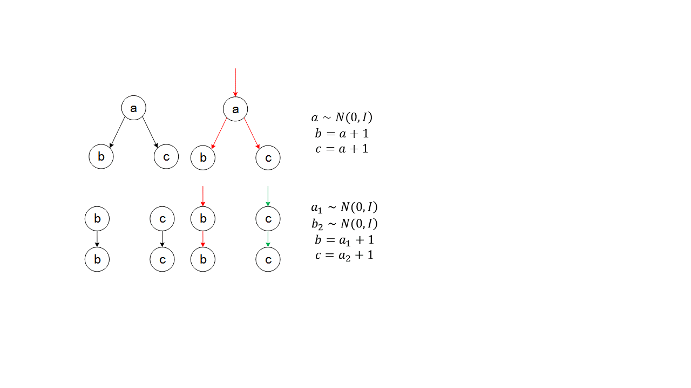

# RANDOM
## Constant Value Tensors
```
tf.zeros
tf.zeros_like
tf.ones
tf.ones_like
tf.fill
tf.constant
```
## Sequences
```
tf.linspace
tf.range
```
Creates a sequence of numbers that begins at start and extends by increments of delta up to but not including limit.
```
range(limit, delta=1, dtype=None, name='range')
range(start, limit, delta=1, dtype=None, name='range')
```
## Random Tensor
Create random tensors with different distributions. The random ops are stateful, and create new random values each time they are
evaluated.
and the seed keyword argment in these function acts in conjunction with the graph level random seed
```
tf.set_random_seed
```
Some conventional distributions,such as normal(Gaussian distribution), truncated_normal, uniform, multinomial, gamma
```
tf.random_normal
tf.truncated_normal
tf.random_uniform
tf.random_shuffle
tf.random_crop                        ---> crop for image input
tf.multinomial
tf.random_gamma
```
The next following example try to explain that when you need two random variables, just one defined is not enough.
All through every fetch, the variables values is different, howver in one time, the variables values is same at all



```
import tensorflow as  tf

a = tf.random_normal([], 0, 1)
b = a + 1
c = a + 2
sess = tf.InteractiveSession()
sess.run([b, c])                       # [1.145123, 2.145123]

b = tf.random_normal([], 0, 1)
a = b + 1
b = tf.random_normal([], 0, 1)
c = b + 1
sess.run([b, c])                       # [0.2580133, 1.2580132]
```

### Examples
```
norm = tf.random_normal([2, 3], mean=-1, stddev=4)
sess.run(norm)
Out[135]: 
array([[ 1.04485011, -3.27299333, -1.52553272],
       [-0.24643952, -9.83152676, -0.71526629]], dtype=float32)
       
       
c = tf.constant([[1, 2], [3, 4], [5, 6]])
shuff = tf.random_shuffle(c)
sess.run(shuff)

Out[138]: 
array([[1, 2],
       [5, 6],
       [3, 4]])
       
sess.run(c)
Out[141]: 
array([[1, 2],
       [3, 4],
       [5, 6]])
       
print(sess.run(norm))
[[-0.01499939  0.16252124  2.79371309]
 [-1.38953209  8.84682083 -3.50333261]]
[[-1.14327836 -1.55230355 -1.63681424]
 [-1.5096972   7.47023201 -1.91704535]]
 
norm = tf.random_normal([2, 3], seed=1234)
sess = tf.Session()
print(sess.run(norm))
[[ 0.51340485 -0.25581399  0.65199131]
 [ 1.39236379  0.37256798  0.20336303]]
[[ 0.96462417  0.34291974  0.24251089]
 [ 1.05785966  1.65749764  0.82108974]]
 
 
var = tf.Variable(tf.random_uniform([2, 3]), name="var")
sess.run(var)
init = tf.global_variables_initializer()
sess.run(init)
sess.run(var)
Out[148]: 
array([[ 0.34862542,  0.64267635,  0.15603614],
       [ 0.57963645,  0.43195641,  0.6803081 ]], dtype=float32)


```
